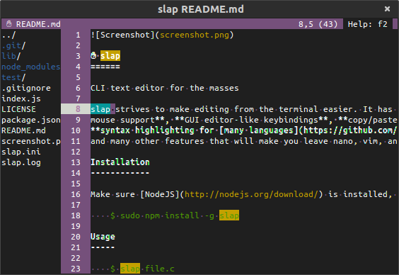

✋ slap
======

CLI text editor for the masses

slap strives to make editing from the terminal easier. It has **first-class
mouse support**, **GUI editor-like keybindings**, **copy/paste support**,
**syntax highlighting for [many languages](https://github.com/isagalaev/highlight.js/tree/master/src/languages)**,
and many other features that will make you leave nano, vim, and emacs behind.

Installation
------------

Make sure [NodeJS](http://nodejs.org/download/) is installed, then:

    $ sudo npm install -g slap

Usage
-----

    $ slap file.c

### Configuration

Copy some or all of the default [configuration](slap.ini) to `~/.slaprc` to
change keybindings, styles, etc. You can also pass options in via command line:

    $ slap --editor.tabSize 2 file.c

Issues
------

### Windows support

Most terminal emulators in Windows do not support mouse events. Currently slap
does not work in Cygwin due to [joyent/node#6459](https://github.com/joyent/node/issues/6459).

### Copying and pasting

Ensure xclip is installed.
